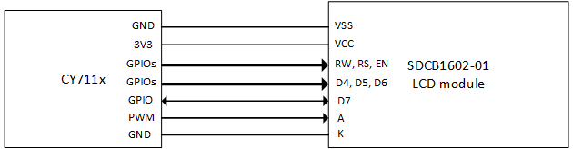
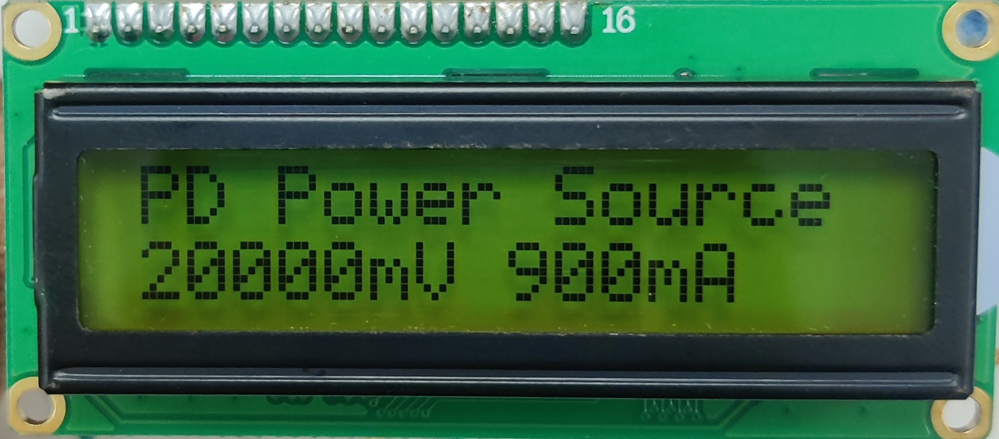
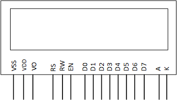
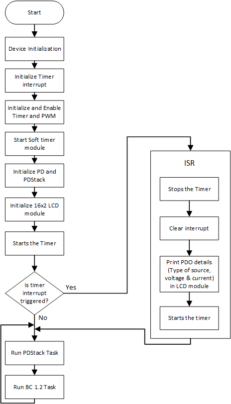

# EZ-PD&trade; PMG1 MCU: USB PD Sink with 16x2 LCD

This code example demonstrates USB Power Delivery (PD) Sink functionality and displays PD contract information such as the type of PD source connected, negotiated voltage and current on LCD, and PWM to control the brightness of the LCD using EZ-PD&trade; PMG1 MCU devices.

[View this README on GitHub.](https://github.com/Infineon/mtb-example-pmg1-usbpd-sink-lcd-display)

[Provide feedback on this code example.](https://cypress.co1.qualtrics.com/jfe/form/SV_1NTns53sK2yiljn?Q_EED=eyJVbmlxdWUgRG9jIElkIjoiQ0UyMzY4MjIiLCJTcGVjIE51bWJlciI6IjAwMi0zNjgyMiIsIkRvYyBUaXRsZSI6IkVaLVBEJnRyYWRlOyBQTUcxIE1DVTogVVNCIFBEIFNpbmsgd2l0aCAxNngyIExDRCIsInJpZCI6Im5zaCIsIkRvYyB2ZXJzaW9uIjoiMi4wLjAiLCJEb2MgTGFuZ3VhZ2UiOiJFbmdsaXNoIiwiRG9jIERpdmlzaW9uIjoiTUNEIiwiRG9jIEJVIjoiV0lSRUQiLCJEb2MgRmFtaWx5IjoiVFlQRS1DIn0=)


## Requirements


- [ModusToolbox&trade;](https://www.infineon.com/modustoolbox) v3.3 or later (tested with v3.3)
- Board support package (BSP) minimum required version: 3.0.0
- Programming language: C
- Associated parts: All [EZ-PD&trade; PMG1 MCU](https://www.infineon.com/PMG1) parts
- 16x2 LCD Module


## Supported toolchains (make variable 'TOOLCHAIN')

- GNU Arm&reg; Embedded Compiler v11.3.1 (`GCC_ARM`) - Default value of `TOOLCHAIN`
- Arm&reg; Compiler v6.22 (`ARM`)
- IAR C/C++ Compiler v9.50.2 (`IAR`)


## Supported kits (make variable 'TARGET')

- [EZ-PD&trade; PMG1-S0 Prototyping Kit](https://www.infineon.com/CY7110) (`PMG1-CY7110`) - Default value of `TARGET`
- [EZ-PD&trade; PMG1-S1 Prototyping Kit](https://www.infineon.com/CY7111) (`PMG1-CY7111`)
- [EZ-PD&trade; PMG1-S2 Prototyping Kit](https://www.infineon.com/CY7112) (`PMG1-CY7112`)
- [EZ-PD&trade; PMG1-S3 Prototyping Kit](https://www.infineon.com/CY7113) (`PMG1-CY7113`)
- [EZ-PD&trade; PMG1-S1 Evaluation Kit](https://www.infineon.com/EVAL_PMG1_S1_DRP) (`EVAL_PMG1_S1_DRP`)
- [EZ-PD&trade; PMG1-S3 Evaluation Kit](https://www.infineon.com/EVAL_PMG1_S3_DUALDRP) (`EVAL_PMG1_S3_DUALDRP`)


## Hardware setup

1. Connect the 16x2 LCD pins to the PMG1 kits as per **Table 1**:

   **Table 1. 16x2 LCD pin connection for PMG1 kits**

   LCD 16x2 pins | PMG1-S0 | PMG1-S1 | PMG1-S2 | PMG1-S3 | EVAL_PMG1_S1_DRP | EVAL_PMG1_S3_DUALDRP
    :---| :-----| :-----| :-----| :-----| :-----| :--------
    VSS | GND   | GND   | GND   | GND   | GND   | GND
    VCC | 3V3   | 3V3   | 3V3   | 3V3   | 3V3   | 3V3
     RS  | J7.12 | J7.16 | J7.14 | J6.12 | J7.16 | J7.20
    RW  | J7.11 | J7.15 | J7.13 | J6.9  | J7.15 | J7.19
    EN  | J7.8  | J7.13 | J7.12 | J6.10 | J6.14 | J7.7
    D4  | J7.6  | J7.12 | J7.11 | J7.6  | J6.10 | J7.27
     D5  | J7.9  | J7.11 | J7.8  | J7.19 | J7.11 | J13.8
    D6  | J6.9  | J7.8  | J7.5  | J7.7  | J7.8  | J13.9
    D7  | J6.10 | J6.15 | J7.4  | J6.17 | J6.15 | J13.10
     A   | J7.7  | J6.16 | J6.11 | J6.11 | J6.16 | J7.9
    K   | GND   | GND   | GND   | GND   | GND   | GND

   **Figure 1. Interface block diagram**

   

This example uses the board's default configuration. See the kit user guide to ensure that the board is configured correctly.


## Software setup

See the [ModusToolbox&trade; tools package installation guide](https://www.infineon.com/ModusToolboxInstallguide) for information about installing and configuring the tools package.

This example requires no additional software or tools.


## Using the code example


### Create the project

The ModusToolbox&trade; tools package provides the Project Creator as both a GUI tool and a command line tool.

<details><summary><b>Use Project Creator GUI</b></summary>

1. Open the Project Creator GUI tool.

   There are several ways to do this, including launching it from the dashboard or from inside the Eclipse IDE. For more details, see the [Project Creator user guide](https://www.infineon.com/ModusToolboxProjectCreator) (locally available at *{ModusToolbox&trade; install directory}/tools_{version}/project-creator/docs/project-creator.pdf*).

2. On the **Choose Board Support Package (BSP)** page, select a kit supported by this code example. See [Supported kits](#supported-kits-make-variable-target).

   > **Note:** To use this code example for a kit not listed here, you may need to update the source files. If the kit does not have the required resources, the application may not work.

3. On the **Select Application** page:

   a. Select the **Applications(s) Root Path** and the **Target IDE**.

   > **Note:** Depending on how you open the Project Creator tool, these fields may be pre-selected for you.

   b.	Select this code example from the list by enabling its check box.

   > **Note:** You can narrow the list of displayed examples by typing in the filter box.

   c. (Optional) Change the suggested **New Application Name** and **New BSP Name**.

   d. Click **Create** to complete the application creation process.

</details>

<details><summary><b>Use Project Creator CLI</b></summary>

The 'project-creator-cli' tool can be used to create applications from a CLI terminal or from within batch files or shell scripts. This tool is available in the *{ModusToolbox&trade; install directory}/tools_{version}/project-creator/* directory.

Use a CLI terminal to invoke the 'project-creator-cli' tool. On Windows, use the command-line 'modus-shell' program provided in the ModusToolbox&trade; installation instead of a standard Windows command-line application. This shell provides access to all ModusToolbox&trade; tools. You can access it by typing "modus-shell" in the search box in the Windows menu. In Linux and macOS, you can use any terminal application.

The following example clones the "[USB PD Sink with 16x2 LCD](https://github.com/Infineon/mtb-example-pmg1-usbpd-sink-lcd-display)" application with the desired name "UsbPdSink16x2LCD" configured for the *PMG1-CY7110* BSP into the specified working directory, *C:/mtb_projects*:

   ```
 project-creator-cli --board-id PMG1-CY7110 --app-id mtb-example-pmg1-usbpd-sink-lcd-display --user-app-name UsbPdSink16x2LCD --target-dir "C:/mtb_projects"
   ```

The 'project-creator-cli' tool has the following arguments:

Argument | Description | Required/optional
---------|-------------|-----------
`--board-id` | Defined in the <id> field of the [BSP](https://github.com/Infineon?q=bsp-manifest&type=&language=&sort=) manifest | Required
`--app-id`   | Defined in the <id> field of the [CE](https://github.com/Infineon?q=ce-manifest&type=&language=&sort=) manifest | Required
`--target-dir`| Specify the directory in which the application is to be created if you prefer not to use the default current working directory | Optional
`--user-app-name`| Specify the name of the application if you prefer to have a name other than the example's default name | Optional

> **Note:** The project-creator-cli tool uses the `git clone` and `make getlibs` commands to fetch the repository and import the required libraries. For details, see the "Project creator tools" section of the [ModusToolbox&trade; tools package user guide](https://www.infineon.com/ModusToolboxUserGuide) (locally available at {ModusToolbox&trade; install directory}/docs_{version}/mtb_user_guide.pdf).

</details>


### Open the project

After the project has been created, you can open it in your preferred development environment.


<details><summary><b>Eclipse IDE</b></summary>

If you opened the Project Creator tool from the included Eclipse IDE, the project will open in Eclipse automatically.

For more details, see the [Eclipse IDE for ModusToolbox&trade; user guide](https://www.infineon.com/MTBEclipseIDEUserGuide) (locally available at *{ModusToolbox&trade; install directory}/docs_{version}/mt_ide_user_guide.pdf*).

</details>


<details><summary><b>Visual Studio (VS) Code</b></summary>

Launch VS Code manually, and then open the generated *{project-name}.code-workspace* file located in the project directory.

For more details, see the [Visual Studio Code for ModusToolbox&trade; user guide](https://www.infineon.com/MTBVSCodeUserGuide) (locally available at *{ModusToolbox&trade; install directory}/docs_{version}/mt_vscode_user_guide.pdf*).

</details>


<details><summary><b>Keil µVision</b></summary>

Double-click the generated *{project-name}.cprj* file to launch the Keil µVision IDE.

For more details, see the [Keil µVision for ModusToolbox&trade; user guide](https://www.infineon.com/MTBuVisionUserGuide) (locally available at *{ModusToolbox&trade; install directory}/docs_{version}/mt_uvision_user_guide.pdf*).

</details>


<details><summary><b>IAR Embedded Workbench</b></summary>

Open IAR Embedded Workbench manually, and create a new project. Then select the generated *{project-name}.ipcf* file located in the project directory.

For more details, see the [IAR Embedded Workbench for ModusToolbox&trade; user guide](https://www.infineon.com/MTBIARUserGuide) (locally available at *{ModusToolbox&trade; install directory}/docs_{version}/mt_iar_user_guide.pdf*).

</details>


<details><summary><b>Command line</b></summary>

If you prefer to use the CLI, open the appropriate terminal, and navigate to the project directory. On Windows, use the command-line 'modus-shell' program; on Linux and macOS, you can use any terminal application. From there, you can run various `make` commands.

For more details, see the [ModusToolbox&trade; tools package user guide](https://www.infineon.com/ModusToolboxUserGuide) (locally available at *{ModusToolbox&trade; install directory}/docs_{version}/mtb_user_guide.pdf*).

</details>


## Operation

1. Connect the board to your PC using the provided USB cable through the KitProg3 USB connector (J1).

2. Complete the steps listed in the [Hardware setup](#hardware-setup) section. 

3. Ensure that the jumper shunt on power selection jumper (J5) is placed at position 2-3 (VIN) to enable programming mode.

4. Program the board using one of the following:

   <details><summary><b>Using Eclipse IDE</b></summary>

      1. Select the application project in the Project Explorer.

      2. In the **Quick Panel**, scroll down, and click **\<Application Name> Program (KitProg3_MiniProg4)**.
   </details>


   <details><summary><b>In other IDEs</b></summary>

   Follow the instructions in your preferred IDE.
   </details>


   <details><summary><b>Using CLI</b></summary>

     From the terminal, execute the `make program` command to build and program the application using the default toolchain to the default target. The default toolchain is specified in the application's Makefile but you can override this value manually:
      ```
      make program TOOLCHAIN=<toolchain>
      ```

      Example:
      ```
      make program TOOLCHAIN=GCC_ARM
      ```
   </details>

5. After programming the kit, change the position on power selection jumper (J5) to 1-2 (VBUS) to power the kit through the USB PD port (J10). Do not change the jumper (J5) position while the cables are connected to power source.

6. Observe that the user LED (LED3) on the board blinks at different rates depending on the type of power adapter connected:

   - If a power adapter supporting USB Power Delivery is connected, the LED blinks at approximately 5 Hz (toggles every 100 ms); the LCD displays **PD Power Source** in the first row and PDO details (voltage and current) in the second row.

   - If a USB Type-C power adapter or a standard downstream port (SDP) is connected, the LED blinks at approximately 1 Hz (toggles every 500 ms); the LCD displays **SDP source** in the first row.

   - If a dedicated charging port (DCP) is connected, the LED blinks at approximately 0.17 Hz (toggles every 3 seconds); the LCD displays **DCP source** in the first row.

   - If a charging downstream port (CDP) is connected, the LED blinks at approximately 0.05 Hz (toggles every 10 seconds); the LCD displays **CDP source** in the first row.

7. Observe that every 1 seconds, the LCD is updated with the connected PD source and contract data.

8. Measure the negotiated VBUS voltage using a multimeter across the DC_OUT terminal block (J9).

**Figure 2. LCD output for PD power source**



> **Note:**  For EVAL_PMG1_S3_DUALDRP Kit, LCD data display is applicable only for Port 0. In case of Port 1, LCD does not print any data.


## Debugging

You can debug the example to step through the code.


<details><summary><b>In Eclipse IDE</b></summary>

Use the **\<Application Name> Debug (KitProg3_MiniProg4)** configuration in the **Quick Panel**. For details, see the "Program and debug" section in the [Eclipse IDE for ModusToolbox&trade; user guide](https://www.infineon.com/MTBEclipseIDEUserGuide).

Ensure that the board is connected to your PC using the USB cable through the KitProg3 USB connector and that the jumper shunt on the power selection jumper (J5) is placed at position 1-2. See the "Debug mode" section in the kit user guide.

For more details, see the "Program and debug" section in the [Eclipse IDE for ModusToolbox&trade; user guide](https://www.infineon.com/MTBEclipseIDEUserGuide).

</details>


<details><summary><b>In other IDEs</b></summary>

Follow the instructions in your preferred IDE.
</details>


## Design and implementation

### Interfacing the LCD

This code example uses a SDCB1602-01 16x2 LCD module, which has 16 columns and 2 rows to display data, and uses a parallel interface to communicate with the MCU. The LCD has 8-bit and 4-bit interface modes. This code example uses the 4-bit interface mode.

The LCD has two registers: 
- The command register stores various commands given to the display.
- The data register stores data to be displayed.

**Figure 3. LCD 16x2 pinout**



**Table 2. LCD pinout**

 Pin number | Pin name | Function description
 :-------  | :------------ | :----------------
 1 | VSS | Ground (GND)
 2 | VCC | 3.3 V
 3 | VO  | Adjust the contrast of the LCD
 4 | RS (register select) | Toggle between command and data register. For command, RS = 0; for data, RS = 1
 5 | RW (read write) | Used for read/write operation. For write, RW = 0; for read, RW = 1
 6 | EN (enable) | Toggled for read/write operations
 7 - 14 | D0–D7 (data pins) | Used to send data/command
 15 | A (anode) | Used for backlight (positive terminal)
 16 | K (cathode) | Used for backlight (negative terminal)

TCPWM is used for controlling the Backlight of the LCD. To change the PWM Duty Cycle, see [PWM LED Example](https://github.com/Infineon/mtb-example-pmg1-pwm-led).


### LCD modes

 - **4-bit mode:** Sends the data nibble by nibble, first the upper nibble and then the lower nibble, and uses data pins D4–D7
 - **8-bit mode:** Sends the data directly and uses data pins D0–D7

**Table 3. 16x2 LCD general commands**

  Hex codes | Command to LCD display
  :-------  | :------------
  0x01 | Clear display
  0x02 | Return home
  0x04 | Decrement cursor (shift cursor left)
  0x06 | Increment cursor (shift cursor right)
  0x05 | Shift display right
  0x07 | Shift display left
  0x0A | Cursor ON, display OFF
  0x0C | Cursor OFF, display ON
  0x0F | Display ON, blinks the cursor
  0x10 | Shift cursor position left
  0x14 | Shift cursor position right
  0x18 | Shift the entire display left
  0x1C | Shift the entire display right
  0x80 | Move cursor to the beginning of the first line
  0xC0 | Move cursor to the beginning of the second line
  0x38 | 2 lines and 5x7 matrix

> **Note:** See the [SDCB1602-01 16x2 LCD module](https://5.imimg.com/data5/HR/NS/JC/SELLER-3287828/16xx01-cob-lcd-display.pdf) datasheet for more details.


### USB PD Sink

See [EZ-PD™ PMG1 MCU: USBPD Sink](https://github.com/Infineon/mtb-example-pmg1-usbpd-sink) to learn about the USB PD Sink functionality.

**Figure 4. Firmware flowchart**




### Resources and settings

**Table 4. Application resources**

 Resource  |  Alias/object     |    Purpose
 :-------- | :-------------    | :------------
 USBPD     | PD_PORT0       | USBPD block used for PD communication
 LED (BSP) | CYBSP_USER_LED | User LED to indicate PD connection state
 TCPWM (PWM) | CYBSP_PWM | To control the backlighting brightness of the LCD

<br>

### List of application files and their usage

**Table 5. Application files and their usage**

File  | Purpose
:-----| :---------
*config.h* | Defines macros for the application configuration
*main.c* | Implements application main function
*pmg1_version.h* | Defines the application version details
*lcd.c & .h* | Defines function prototype for 16x2 LCD

<br>


## Related resources

Resources  | Links
-----------|----------------------------------
Application notes |[AN232553](https://www.infineon.com/AN232553) – Getting started with EZ-PD&trade; PMG1 MCU on ModusToolbox&trade; software <br> [AN232565](https://www.infineon.com/an232565) – EZ-PD&trade; PMG1 hardware design guidelines and checklist
Code examples  | [Using ModusToolbox&trade;](https://github.com/Infineon/Code-Examples-for-ModusToolbox-Software) on GitHub
Device documentation | [EZ-PD&trade; PMG1 MCU datasheets](https://www.infineon.com/PMG1DS)
Development kits | Select your kits from the [Evaluation Board Finder](https://www.infineon.com/cms/en/design-support/finder-selection-tools/product-finder/evaluation-board) page.
Libraries on GitHub | [mtb-pdl-cat2](https://github.com/Infineon/mtb-pdl-cat2) – Peripheral Driver Library (PDL) and documents
Middleware on GitHub | [pdstack](https://github.com/Infineon/pdstack) – PDStack middleware library and docs <br>  [pdutils](https://github.com/Infineon/pdutils) – PDUtils middleware library and docs <br>[pmg-app-common](https://github.com/Infineon/pmg-app-common) – PMG Application Common middleware library and documents
Tools  | [ModusToolbox&trade;](https://www.infineon.com/modustoolbox) – ModusToolbox&trade; software is a collection of easy-to-use libraries and tools enabling rapid development with Infineon MCUs for applications ranging from wireless and cloud-connected systems, edge AI/ML, embedded sense and control, to wired USB connectivity using PSOC&trade; Industrial/IoT MCUs, AIROC&trade; Wi-Fi and Bluetooth&reg; connectivity devices, XMC&trade; Industrial MCUs, and EZ-USB&trade;/EZ-PD&trade; wired connectivity controllers. ModusToolbox&trade; incorporates a comprehensive set of BSPs, HAL, libraries, configuration tools, and provides support for industry-standard IDEs to fast-track your embedded application development.

<br>


## Other resources

Infineon provides a wealth of data at [www.infineon.com](https://www.infineon.com) to help you select the right device, and quickly and effectively integrate it into your design.


## Document history

Document title: *CE236822* – *EZ-PD&trade; PMG1 MCU: USB PD sink with 16x2 LCD*

 Version | Description of change
 ------- | ---------------------
 1.0.0   | New code example
 2.0.0   | Updated to use the PmgAppCommon middleware

<br>


All referenced product or service names and trademarks are the property of their respective owners.

The Bluetooth&reg; word mark and logos are registered trademarks owned by Bluetooth SIG, Inc., and any use of such marks by Infineon is under license.


---------------------------------------------------------

© Cypress Semiconductor Corporation, 2020-2025. This document is the property of Cypress Semiconductor Corporation, an Infineon Technologies company, and its affiliates ("Cypress").  This document, including any software or firmware included or referenced in this document ("Software"), is owned by Cypress under the intellectual property laws and treaties of the United States and other countries worldwide.  Cypress reserves all rights under such laws and treaties and does not, except as specifically stated in this paragraph, grant any license under its patents, copyrights, trademarks, or other intellectual property rights.  If the Software is not accompanied by a license agreement and you do not otherwise have a written agreement with Cypress governing the use of the Software, then Cypress hereby grants you a personal, non-exclusive, nontransferable license (without the right to sublicense) (1) under its copyright rights in the Software (a) for Software provided in source code form, to modify and reproduce the Software solely for use with Cypress hardware products, only internally within your organization, and (b) to distribute the Software in binary code form externally to end users (either directly or indirectly through resellers and distributors), solely for use on Cypress hardware product units, and (2) under those claims of Cypress's patents that are infringed by the Software (as provided by Cypress, unmodified) to make, use, distribute, and import the Software solely for use with Cypress hardware products.  Any other use, reproduction, modification, translation, or compilation of the Software is prohibited.
<br>
TO THE EXTENT PERMITTED BY APPLICABLE LAW, CYPRESS MAKES NO WARRANTY OF ANY KIND, EXPRESS OR IMPLIED, WITH REGARD TO THIS DOCUMENT OR ANY SOFTWARE OR ACCOMPANYING HARDWARE, INCLUDING, BUT NOT LIMITED TO, THE IMPLIED WARRANTIES OF MERCHANTABILITY AND FITNESS FOR A PARTICULAR PURPOSE.  No computing device can be absolutely secure.  Therefore, despite security measures implemented in Cypress hardware or software products, Cypress shall have no liability arising out of any security breach, such as unauthorized access to or use of a Cypress product. CYPRESS DOES NOT REPRESENT, WARRANT, OR GUARANTEE THAT CYPRESS PRODUCTS, OR SYSTEMS CREATED USING CYPRESS PRODUCTS, WILL BE FREE FROM CORRUPTION, ATTACK, VIRUSES, INTERFERENCE, HACKING, DATA LOSS OR THEFT, OR OTHER SECURITY INTRUSION (collectively, "Security Breach").  Cypress disclaims any liability relating to any Security Breach, and you shall and hereby do release Cypress from any claim, damage, or other liability arising from any Security Breach.  In addition, the products described in these materials may contain design defects or errors known as errata which may cause the product to deviate from published specifications. To the extent permitted by applicable law, Cypress reserves the right to make changes to this document without further notice. Cypress does not assume any liability arising out of the application or use of any product or circuit described in this document. Any information provided in this document, including any sample design information or programming code, is provided only for reference purposes.  It is the responsibility of the user of this document to properly design, program, and test the functionality and safety of any application made of this information and any resulting product.  "High-Risk Device" means any device or system whose failure could cause personal injury, death, or property damage.  Examples of High-Risk Devices are weapons, nuclear installations, surgical implants, and other medical devices.  "Critical Component" means any component of a High-Risk Device whose failure to perform can be reasonably expected to cause, directly or indirectly, the failure of the High-Risk Device, or to affect its safety or effectiveness.  Cypress is not liable, in whole or in part, and you shall and hereby do release Cypress from any claim, damage, or other liability arising from any use of a Cypress product as a Critical Component in a High-Risk Device. You shall indemnify and hold Cypress, including its affiliates, and its directors, officers, employees, agents, distributors, and assigns harmless from and against all claims, costs, damages, and expenses, arising out of any claim, including claims for product liability, personal injury or death, or property damage arising from any use of a Cypress product as a Critical Component in a High-Risk Device. Cypress products are not intended or authorized for use as a Critical Component in any High-Risk Device except to the limited extent that (i) Cypress's published data sheet for the product explicitly states Cypress has qualified the product for use in a specific High-Risk Device, or (ii) Cypress has given you advance written authorization to use the product as a Critical Component in the specific High-Risk Device and you have signed a separate indemnification agreement.
<br>
Cypress, the Cypress logo, and combinations thereof, ModusToolbox, PSoC, CAPSENSE, EZ-USB, F-RAM, and TRAVEO are trademarks or registered trademarks of Cypress or a subsidiary of Cypress in the United States or in other countries. For a more complete list of Cypress trademarks, visit www.infineon.com. Other names and brands may be claimed as property of their respective owners.